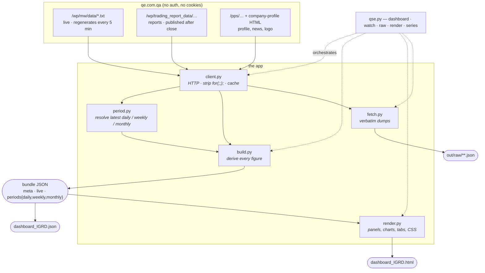

# Architecture

## The one idea

**Exactly one file touches the network. Everything after it is pure data transformation.**

```
qe.com.qa  →  client.py  →  period.py  →  build.py  →  bundle (JSON)  →  render.py  →  HTML
              ─────────     ─────────     ────────     ─────────────     ─────────
              fetch +       which         raw rows     the contract      one
              decode +      week/month    → figures    (also the         self-contained
              cache         is "latest"?               data export)      page
```

Read left to right: bytes become rows, rows become a period's worth of figures, figures
become a JSON bundle, the bundle becomes a page. Each arrow is a plain function call, and
nothing ever flows backwards.

That single boundary is why `test_build.py` runs 92 checks with the network unplugged: the
test swaps in a `StubClient` that returns captured rows, and the other 1,500 lines behave
identically because they never knew where the rows came from.



## The six modules

| File | Lines | Job | Knows about |
|---|---|---|---|
| `qse/client.py` | 392 | Fetch and decode. The only networked code. | URLs, HTTP, the `for(;;);` guard, the cache |
| `qse/period.py` | 211 | Answer "which daily / weekly / monthly period is the latest published one, and which sessions does it contain?" | the QSE trading calendar |
| `qse/build.py` | 465 | Turn raw rows into every figure the dashboard shows. | the derivations, nothing about HTTP or HTML |
| `qse/render.py` | 865 | Turn a bundle into one self-contained page. | panels, SVG charts, CSS, tabs |
| `qse/fetch.py` | 74 | Dump feeds to disk untouched. | filesystem layout only |
| `qse/archive.py` | 210 | Persist every refresh: tick logs + write-once period bundles. | data lifetimes, JSONL |
| `qse.py` | 248 | CLI and the watch loop. | argument parsing, the interval |
| `app.py` | 150 | Optional Streamlit shell: picker, timer, downloads. | embeds `render()` output; changes nothing below it |

`render.py` is the biggest file and the least interesting — it is mostly SVG string
building and one long CSS block. `build.py` is where the actual thinking is.

## Why `period.py` is its own module

Because "what is last week" turned out to be the hardest problem in the project. The
report tree files four period shapes:

```
daily    /wp/trading_report_data/2026/08/13/StocksSummary.txt
weekly   /wp/trading_report_data/2026/08/W2/StocksSummary.txt
monthly  /wp/trading_report_data/2026/07/StocksSummary.txt
yearly   /wp/trading_report_data/2025/StocksSummary.txt
```

Three things make the weekly path awkward:

1. Weeks run **Sunday–Thursday** and are numbered inside the month — but the counter only
   advances on a Sunday *after* a trading day has been emitted, so a month opening on a
   Saturday still starts at `W1`.
2. A week straddling a month boundary is filed under the **later** month. `2026/01/W1`
   closes on 2025-12-31.
3. The files carry no date field at all. `DATE_TYPE` says `"Week"` and nothing else.

So the week index is only a guess, and `_resolve_week_end` **pins it by matching the
week's `INDEX_VALUE` against daily closes** until it finds the session that produced it.
That check was validated against nine months of live data: 35 of 36 weeks resolved from
the rule alone, and the one that didn't was the New Year boundary week — which the
close-matching fallback then caught.

## Two data families with different physics

This is the distinction that shapes everything else.

| | Live feeds | Report files |
|---|---|---|
| Path | `/wp/mw/data/*.txt` | `/wp/trading_report_data/…` |
| Changes | every 5 minutes while open | once, after the period closes |
| Has a period? | no — always "now" | yes |
| Immutable? | no | **yes, once published** |
| Carries | price, index, session state, fundamentals | OHLC, ownership, investor activity |

Because report files are immutable, they are cached on disk forever — that's why the first
build takes ~20 s (250 daily files for the 52-week index range) and every later one takes
seconds. Live feeds are never served from cache, but a copy is kept so a network failure
falls back to the last snapshot instead of killing the build.

The consequence you feel in the UI: **during trading hours the current session has no
report file yet.** So the Daily tab shows the last *closed* session, and only the live
header strip moves. `watch` calls `client.forget()` on today's path each pass so that the
moment the exchange publishes, the next rebuild picks it up.

## The bundle is the contract

`build.py` and `render.py` never call each other. They agree on one JSON shape:

```
{
  "meta":    { symbol, name, sector, builtAt, refreshSeconds, defaultKind, logo, unavailable },
  "live":    { state, lastUpdate, indexValue, changePct, quote{…} },
  "periods": {
    "daily":   { period, share, index, comparison, sectorIndices, allIndices,
                 topGainers, topLosers, topByValue, topByVolume,
                 shareholderActivity, ownership, insiderTrades, indexSeries },
    "weekly":  { …same shape… },
    "monthly": { …same shape… }
  }
}
```

Three things fall out of that for free:

- `qse.py render bundle.json` re-renders with **no network** — restyle the page without
  refetching anything.
- The page embeds its own bundle in `<script type="application/json" id="bundle">`, so the
  HTML is simultaneously the data export.
- Any other consumer — Excel, a notebook, PowerMinds — reads the JSON and ignores the HTML.

`history` and `intraday` sit at the **top level**, not inside a period, because the share
graph is not period-specific. That is also why it renders once above the tab strip: putting
it inside `_tab_body` duplicated its range-selector element ids three times, which is
invalid HTML and broke range switching on every tab but the first.

## The archive

`archive.py` is a fourth sink alongside the page and the bundle, written on every build.
It splits by data lifetime rather than by refresh, because those are not the same thing:

| Store | Shape | Lifetime | Why |
|---|---|---|---|
| `archive/live/index/<session>.jsonl` | one line per feed tick, market-wide | append-only | **irreplaceable** — the site publishes no intraday history |
| `archive/live/<SYM>/<session>.jsonl` | one line per tick, that symbol | append-only | split from the index tick so N symbols don't store N copies of it |
| `archive/market/<session>.jsonl` | same, all instruments | append-only, opt-in | ~25 KB a tick, so a deliberate choice |
| `archive/periods/<SYM>/<kind>/<period>.json` | one closed period | write-once | a closed period never changes; re-saving churns identical bytes |
| `archive/manifest.json` | index | rewritten | so a consumer needs no directory walking |

Two details that matter more than they look:

- **Dedup keys on the feed's `LastUpdate` truncated to the minute, per stream.** Three
  separate things each caused duplicates before this settled: the refresh interval drifting
  against the exchange's 5-minute cadence; the feed republishing one tick with its seconds
  field flipped (`10:22:02` and `10:22:03` are one tick); and a single interleaved log where
  comparing against the last line meant `IGRD → QNBK → IGRD` re-recorded. One file per
  stream plus a minute-precision key fixes all three, and keeps dedup a cheap last-line
  read. Archiving is now idempotent under both the `watch` loop and Streamlit's
  rerun-on-every-click model.
- **The tail-read window expands.** Finding the last line means seeking near the end of
  the file, but a market-log line runs to ~25 KB. A fixed 4 KB window landed mid-record,
  parsed nothing, and silently disabled deduplication — a bug that shipped and is now
  pinned by a test that writes a deliberately oversized line.

Sessions are bucketed by **the feed's own date**, not the local clock, so a tick can never
land in the wrong day's file.

## Walking one command through

`python3 qse.py watch IGRD --refresh 300`

1. **`qse.py`** builds a `Client` pointed at `out/.cache`, installs signal handlers, enters
   the loop.
2. **`build()`** pulls `MarketWatch.txt` once and indexes it by symbol — this is the only
   source of share count, book value and dividend yield.
3. For each of `daily, weekly, monthly`, **`period.resolve()`** probes backwards until it
   finds a published period, then returns a `Period(kind, path, label, start, end, days)`.
4. **`build_period()`** reads that period's `StocksSummary`, `MarketSummary`,
   `IndicesSummary`, `Top5`, `VentureSummary`, `InvestorActivity`, and derives what the
   feeds don't carry: market cap, cap ranks, price-to-book, 1-year change, the 52-week
   index range.
5. Weekly and monthly are missing `OwnershipPercentage`, `InsiderTrades` and
   `MajorActivity`, so those get reconstructed from the daily files inside the period —
   register read at the period end against the session before it opened, insider trades
   summed per insider.
6. **`render()`** emits panels, inline SVG charts, the CSS-only tab strip, and a
   `<meta http-equiv="refresh">`.
7. `client.forget()` drops today's cached report path; sleep 300 s; repeat.

## Where to change what

| You want to… | Go to |
|---|---|
| add an endpoint | `client.py` — add a method, nothing else changes |
| add a metric to a panel | `build_period()` in `build.py`, then read it in `render.py` |
| add a panel, restyle, fix a chart | `render.py` only — then `qse.py render` to preview |
| add a period (yearly) | `period.py`: a `latest_yearly()` and one entry in `KINDS` |
| change the refresh cadence | `--refresh` — it sets the loop *and* the page's meta-refresh |
| track a second symbol | nothing; `qse.py watch QNBK` writes its own pair of files |

## Testing

`test_build.py` subclasses `Client` and overrides `live()` / `try_report()` with captured
rows, so the whole chain runs offline. It asserts three different kinds of thing:

- **The PDF's own figures** — if a derivation drifts, the numbers stop matching the source
  dashboard and the test says so.
- **The period rules** — Sunday-rolling week numbering including months that open on a
  Saturday, and the weekly/monthly aggregation of insider trades.
- **Structure** — that the shareholders-activity table stays rectangular when a
  nationality is missing a Buy or Sell leg, which is the bug rowspan tables invite.

## What is deliberately *not* here

- No database. The report files are already an immutable, addressable archive; `out/.cache`
  mirrors the slice you've touched.
- No web server. The output is one HTML file, so it survives being emailed or opened from
  disk.
- No dependencies. Standard library only, with one optional exception: Pillow is used to
  downscale oversized logos (`IGRD.jpg` is 686 KB) and silently skipped if absent.
- No scheduler. `watch` is a loop; if you'd rather use `cron` or `launchd`, call
  `qse.py dashboard` instead and drop the loop entirely.
